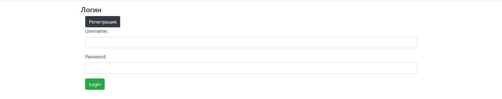
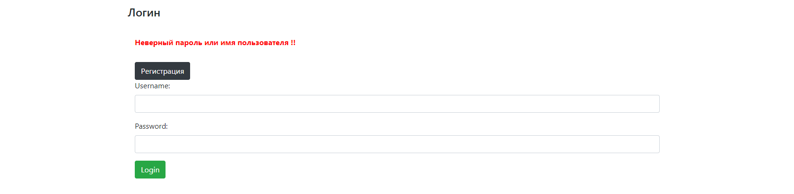
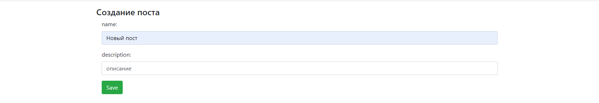
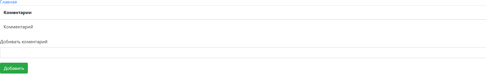
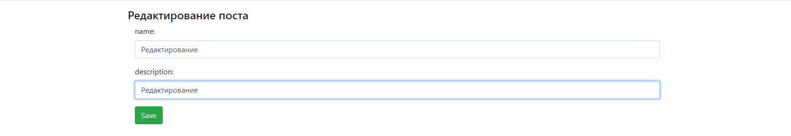
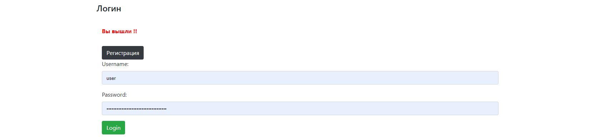

#Данное Spring Boot приложение представляет собой систему публикации постов:

1. Spring Boot
2. Spring Core (DI, IoC)
3. Spring MVC
4. Spring Data JPA
5. Spring Security
6. PostgreSQL

  ## При входе должна быть регистрация пользователя
  
  ## Ошибка входа 

## Главная страница

## Создание нового поста

## Новый пост выводится на главную страницу с возможностями коментировать данныый пост, редактировать и удалять

## Добавление комментарий к посту

## Редактирование поста

## Выход 

